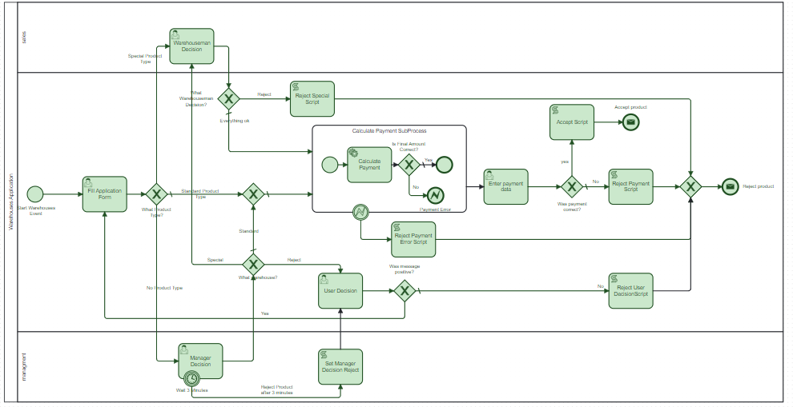
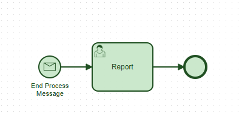

# Camunda warehouses

### Modeling and implementation of the warehouse businnes process using camunda and camunda modeler.

## Built With
[![Java][Java]][Java-url]
[![Camunda][Camunda]][Camunda-url]

## Getting started
### Requirements:
<ul>
    <li> Java 11 </li>
    <li> Maven </li>
    <li> Camunda Modeler </li>
    <li> Camunda 7 </li>
</ul>

### How to run?
1. Clone this repository
2. Run camunda `./PATH_TO_CAMUNDA/start-camunda.sh`
3. Move to repository folder and install maven `mvn install`
4. Enter `http://localhost:8080/camunda/app/tasklist/default/#/login` and login with 
username: `demo`, passsword: `demo`
5. Click `Tasklist` -> `Start process` -> `Warehouses`
6. You can open camunda modeler to follow the BPMN process

## BPMN Processes
### Main process

### Subprocess (report generator)

<!-- MARKDOWN LINKS & IMAGES -->

<!-- https://www.markdownguide.org/basic-syntax/#reference-style-links -->
[Java]:https://img.shields.io/badge/Java-ED8B00?style=for-the-badge&logo=openjdk&logoColor=white
[Java-url]: https://docs.oracle.com/en/java/
[Camunda]:https://img.shields.io/badge/Camunda-black?style=for-the-badge
[Camunda-url]: https://camunda.com/

